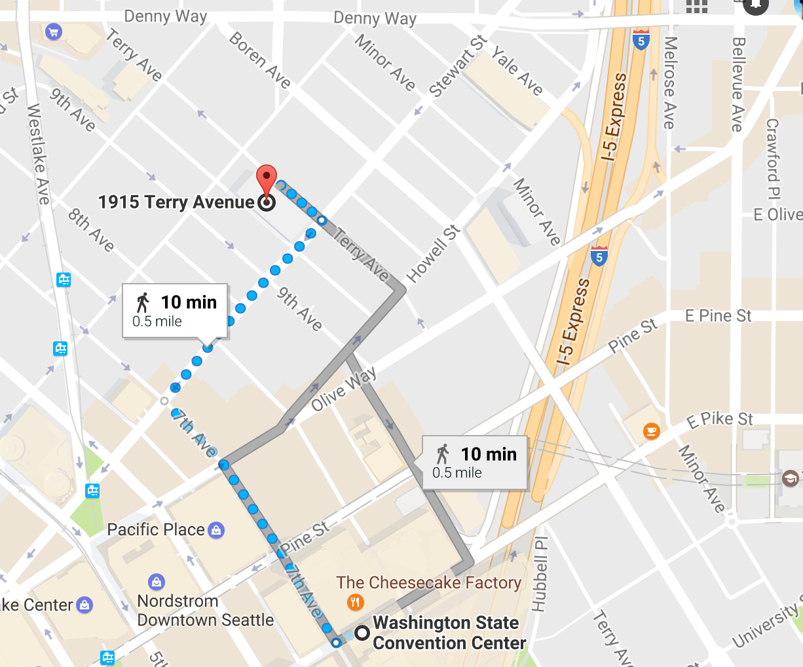
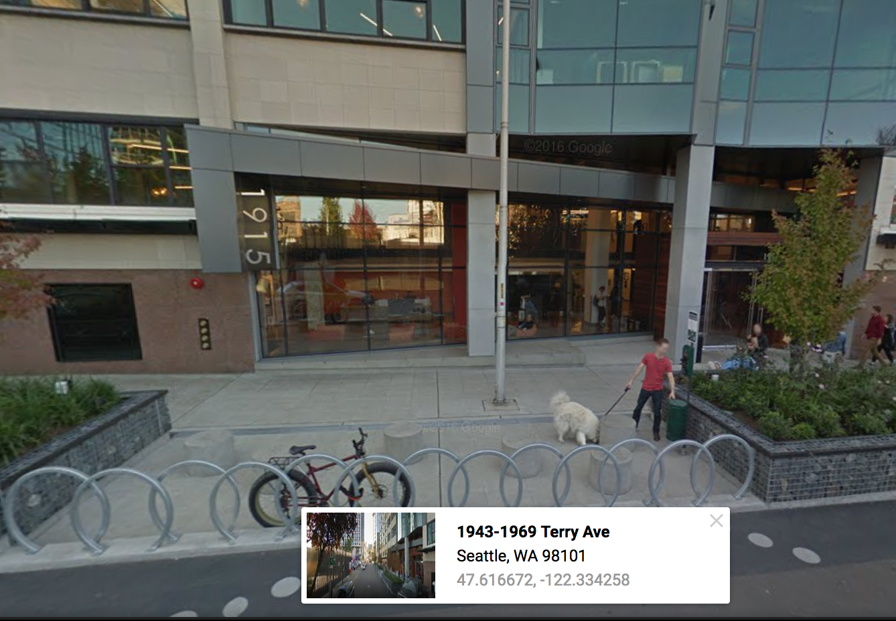

Instructions for attendees
==========================

The course will be held at Amazon's Kumo center at 1915 Terry Ave in Seattle.
Attendees can either head directly to the Kumo center and arrive after 8:30am
but before 8:45am or we will have an instructor at the AMS registration desk who
will walk with attendees leaving at 8:30am **sharp**. 

Kumo is a 10 minute, half mile walk from the convention center. On arriving at
1915 Terry Ave proceed into the building and follow the signs to the tutorial
room. Instructors will also be there to guide you.

Coffee and light refreshments will be provided. The course will begin with some
introductions and setting up of wifi. You will have received instructions for
setting up an Amazon Web Services account prior to the workshop, **it is
essential you have your account set up and have been able to log into the AWS
Console**.

Lunch
-----
Lunch will be on your own, although groups will likely form. Yelp_ shows a
number of lunch venues within easy walk. Lunch is from noon to 1:30pm. Please
ensure you are back at the Kumo center before 1:30pm.

Course Requirements
-------------------
Attendees need their own laptops with a Secure Shell (SSH) client installed.
MacOS/OSX has this installed and is accessible via the terminal, Putty has been
tested and works on Windows. Attendee laptops will also need a browser with the
ability to add security exceptions for secure sites. We have tested this on
Firefox and Safari. Laptops with very restrictive firewall rules will be
difficult to work with. Specifically ports 22,443 and 8888 need to be used and
should not be locked down. 

Course Materials
----------------
Materials are available at https://github.com/openradar/AMS_radar_in_the_cloud
and are currently being updated. Materials will also be distributed by
thumbdrive to attendees. 

Instructors
-----------
Scott Collis, Argonne National Laboratory

Jonathan Helmus, Argonne National Laboratory

Gökhan Sever, Argonne National Laboratory

Ryan May, Unidata

Jed Sundwall, Amazon

Mark Korver, Amazon

Acknowledgements
----------------
Support for this course is provided by the ARM Climate Research Facility, a
Department of Energy, Office of Science user facility, Unidata, a National
Science Foundation Community Program and by Amazon Web Services. 

.. _Yelp: https://www.yelp.com/search?find_desc=Lunch&find_loc=1915+Terry+Ave,+Seattle,+WA,+United+States&start=0&open_time=9420
