Starting and Provisioning an EC2 Instance
=========================================

Aim
---
This course will be taught using Jupyter [1] notebooks hosted on an Amazon Web
Services (AWS) Elastic Cloud Compute (EC2) instance. The aim of these
instructions is to: Start an EC2 instance with the correct access permissions
and use the key provided to log in, run some pre-defined scripts to provision
the EC2 instance with Anaconda Python [2] and the tools required for the course
and, finally, to start the Jupyer notebook server and connect to it using a web
browser. 

First: Stanting an EC2 instance
-------------------------------
1) Point your browser at https://aws.amazon.com/ and click "sign into the console" in the top right hand corner. 
2) Log in with the credentials you generated using the pre-course instructions,
once authenticated this will take you to the console which will look *similar*
to this:

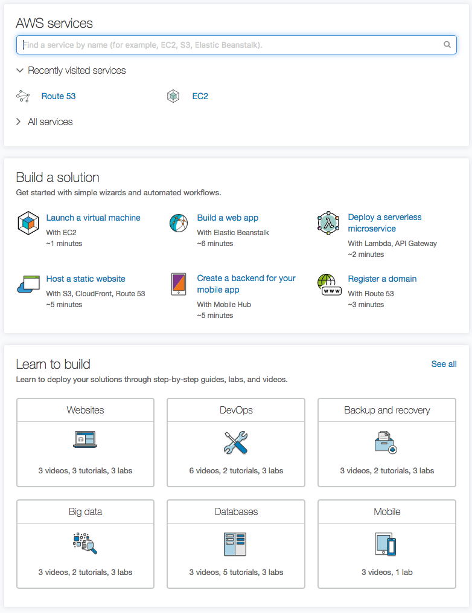

3) Type "ec2" into the text box under "AWS services" and click the first option
in the drop down box. This will land you on a page that looks similar to this
(of course you will not have existing snapshots etc...):

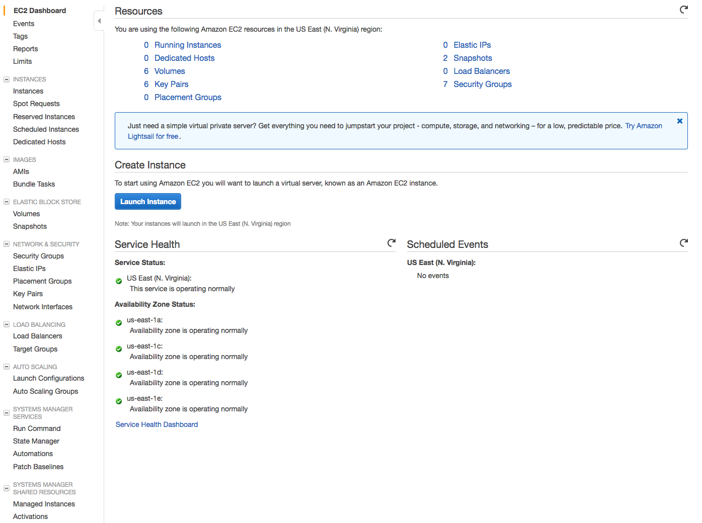

3) If it is not expanded out already (ie there is a "+" sign) click on "Instances" and in the menu below it click on "Instances" and you will be greeted by this screen:

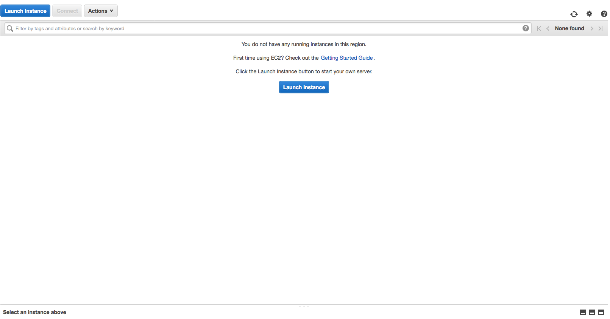

You can now click on "Launch Instance" on either blue and white button.

4) You will be greeted by a page that looks like this:

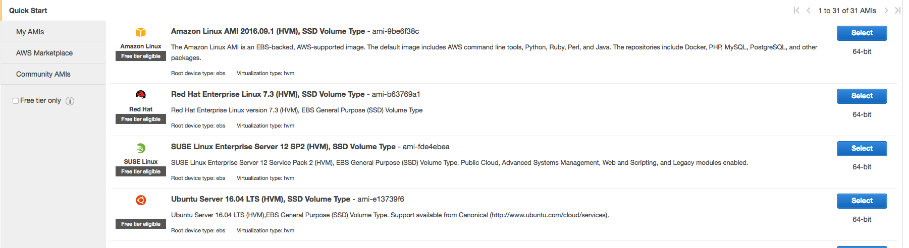

click select next to the "Ubuntu Server 16.04 LTS (HVM), SSD Volume Type"
option. The next page asks you to click a radio button next to the "size" of the
machine you want to start. **While you are experimenting** use "t2.micro" which
gives you a 1GB 1CPU EC2 instance. **For the course** 1GB will not cut it,
select "m4.large". The on demand pricing [3] is 10.8 cents an hour.

.. image:: images/setup5_machines.png
   :scale: 100 %
   :alt: alternate text
   :align: center

Once your selection has been made click the **gray** button "Next: Configure
Instance Details". 

5) The next page can be left as all defaults... Click the **gray** button "Next:
Add Storage"

6) Again, this can be left as all defaults. Click the **gray** button "Next:
Add Tags"

7) *Again*, no need to add tags for the purposes of this course... Once more
click the **gray** button "Next: configure Security Group"

8) Now we have work to do! We need to configure our instance to be able to serve
the Jupyter notebook via HTTPS on port 8888. You will see a page similar to that
below. Make sure "Create a new security group" is checked, later you can select
"select and existing group" to save you time! Enter a simple name for the
Security group name like "j_sever". Enter something descriptive for the
Description. 

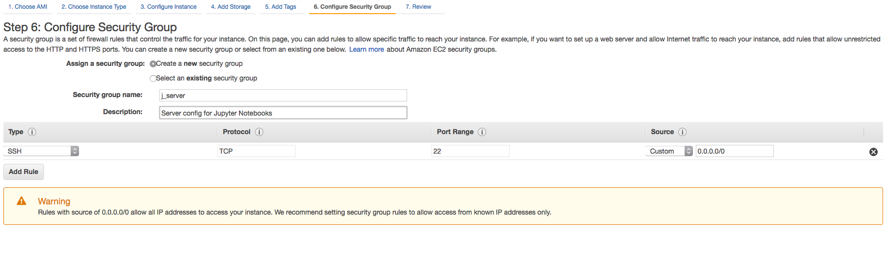

We need to configure to allow connections from any IP to ports 443 (HTTPS) and
8888 (where Jupyter listens). Click "Add Rule". This will create a new row. On
the new row the drop down box on the left will default to "Custom TCP Rule".
Click it and select "HTTPS". Then click "Add Rule" again but this time, in the
new row leave the drop down on "Custom TCP Rule". In that same, third, row enter
"8888" into "Port Range" column and "0.0.0.0/0" in the source column. Once done
it should look like this:

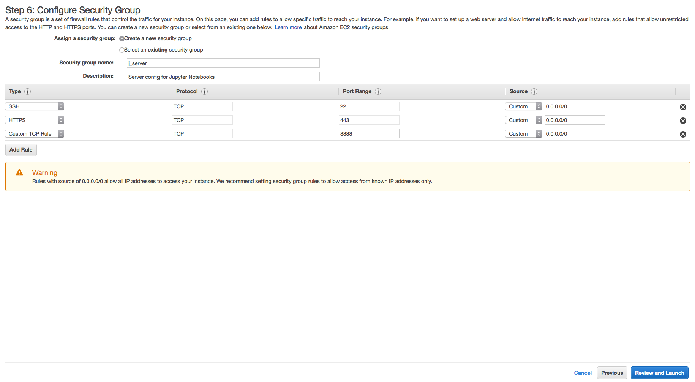

9) Now we can click the **blue** button "Review and Launch". You will be presented with a page like this for one final check.

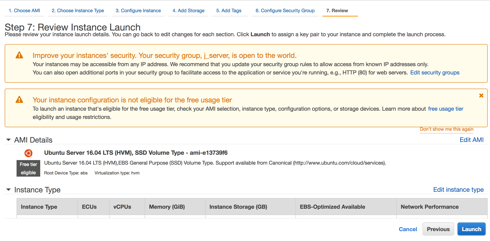

10) click Launch and a dialog pops up like this:

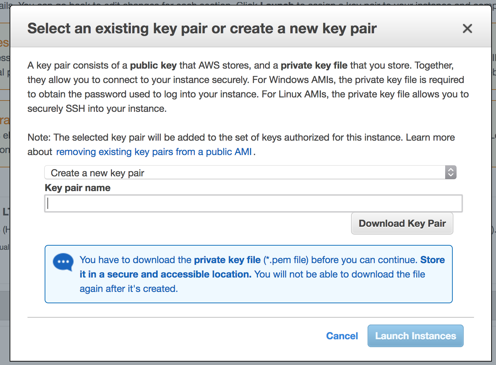

The top drop down can be either "use existing pair", "create new pair" or
"proceed without pair". Select "Create new pair", in the text entry below think
of a good name (eg "jupyter") and click on download key pair. A save dialog will
pop up *REMEBER WHERE YOU SAVED IT!* we will call this "/path/to/key/" in future
reference so the key is at "/path/to/key/key_name.pem".

Once you have downloaded the key the **blue** "Launch Instance" button will be
un-grayed and you can click it!

11) You will now have a screen like this (after a spinning wheel screen):

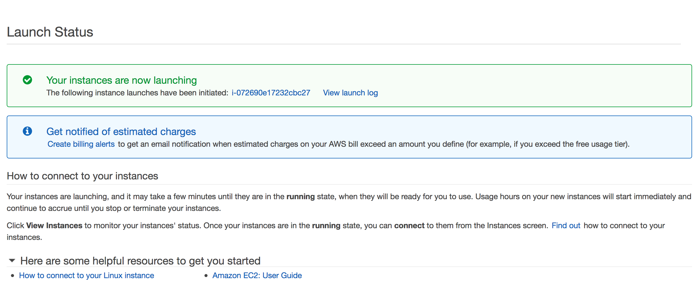

click on the hyperlink starting with "i", in our case "i-072690e17232cbc27". You
will get a window like the one below. *Some entries may be blank until the
instance comes up*. 

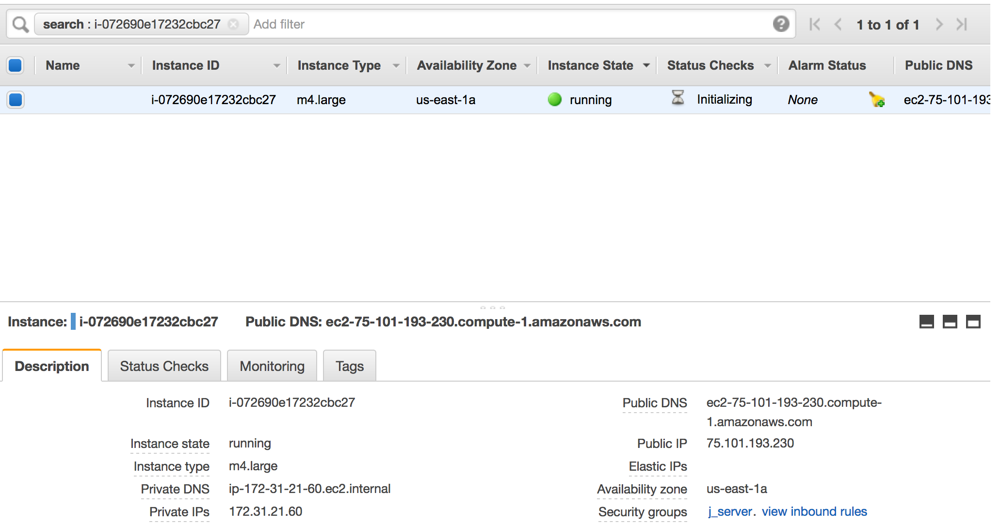

Second: Logging into your instance
----------------------------------
12) You will need an SSH client. These instructions will vary from client to
client. Initially this tutorial will have instructions for a terminal based
client available on Linux and MacOS/OSX. 

Select and copy the domain name next to "Public DNS". First we we need to change
the permissions on the key file.

to  Go to a terminal and type:

chmod 400 /path/to/key/key.pem (replace with your actual path to your key).

"ssh -i /path/to/key/key_name.pem ubuntu@" and copy paste the domain name to the
end of the file.. Hit enter and answer "yes" when it asks if you want to continue connecting. **YES! You are now logged into your instance!**.
 What you will have is something like:

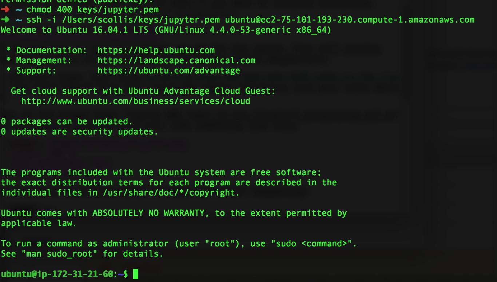

Third: Provisioning your instance
---------------------------------
13) We now need to load on software we use for the course. This will involve
executing a shell script located in the course GitHub Repository.

In the shell type: "git clone https://github.com/openradar/AMS_radar_in_the_cloud", hit enter/return this will clone the remote repository into your local machine. 

Then, at the prompt type: "source AMS_radar_in_the_cloud/ec2_setup/setup_ec2.sh"
you will have a terminal that will look something like this:

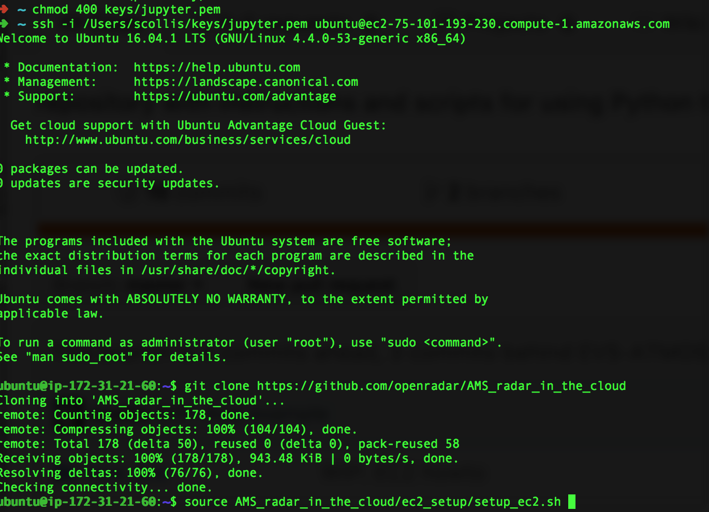

Hit enter/return and all kinds of magic will start happening! 

The script will pause for some time after "jupyter-1.0.0- 100% ..". 

14) After some time the script will prompt you for a password. Enter something,
enter it again.. **remeber it!**

Fourth: Starting the Jupyter notebook
-------------------------------------
15) After the script finishes it should finish with a set of lines like this:

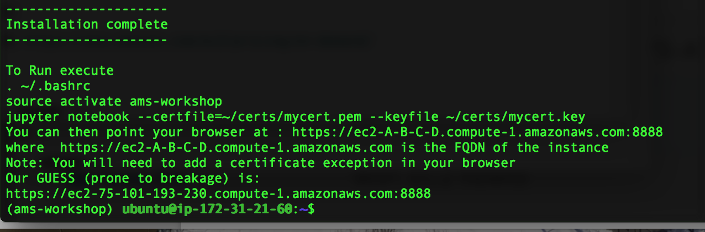

In the command line run the lines (By copy pasting if you choose):

. ~/.bashrc

source activate ams-workshop

jupyter notebook --certfile=~/certs/mycert.pem --keyfile ~/certs/mycert.key

16) The Jupyter notebook has now started! Huzzah! Your terminal should look like
this: 

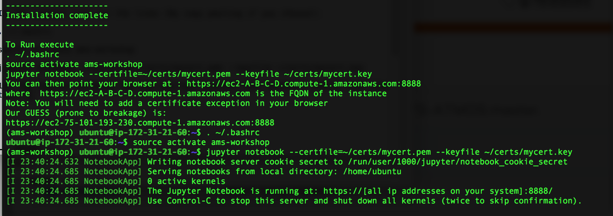

One last step.. You can see a line after "Our GUESS (prone to breakage) is:".
This is the expected location of your Jupyter notebook server.. Copy that line
to the clipboard and open a browser window.. Our example here uses Firefox.
Paste the address in the "Search or enter address" text entry box and press
enter. You should get a screen like this:

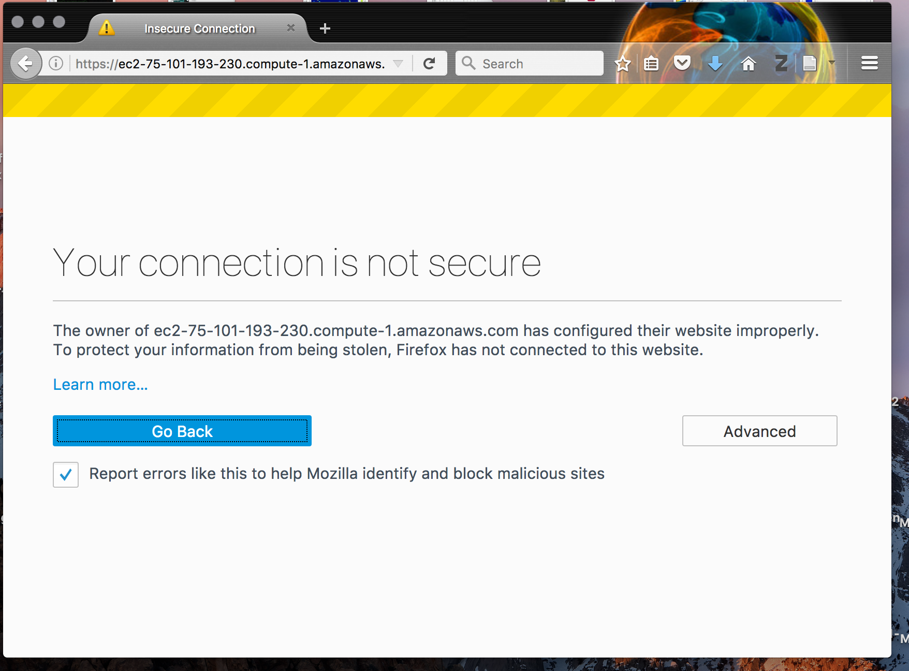

**ONLY EVER DO THIS FOR SITES YOU COMPLETELY TRUST**. Click "Advanced" and then
click "Add Exception". A window will drop down, click "Confirm security
exception". **Bingo** you should now be presented with a page asking for your
password.. enter it and you are good to go!

**NOTE FOR SAFARI USERS:** Do not just hit "continue".. This will allow you to
get into the notebook server but the kernel will not be able to connect.. Click
"Show Certificate" and click the upper left hand radio button to accept the
generate certificate.

[1] http://jupyter.org/

[2] https://www.continuum.io/downloads

[3] https://aws.amazon.com/ec2/pricing/on-demand/
